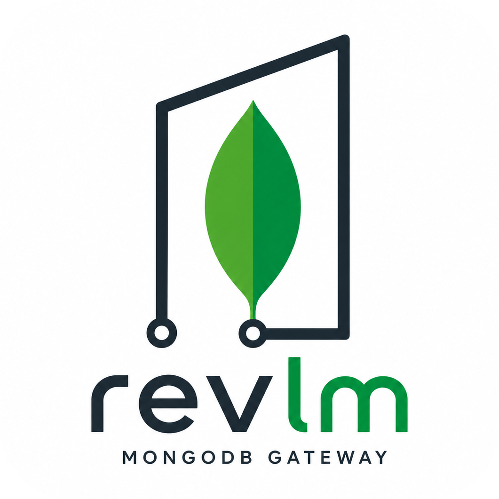

<p align="center">
  
</p>

<p align="center">
  <a href="https://www.npmjs.com/package/@kedaruma/revlm-server"></a>
  <a href="https://www.npmjs.com/package/@kedaruma/revlm-client"></a>
  <a href="https://www.npmjs.com/package/@kedaruma/revlm-shared"></a>
  <a href="https://github.com/kedaruma/revlm/blob/main/LICENSE"></a>
  
</p>

# Revlm

[English README](README.md)  

MongoDB Realm App Services から移行するアプリ向けの、セルフホスト可能な TypeScript ゲートウェイです。

Revlm は、自前の MongoDB とサーバー基盤の上に Realm ライクなクライアント API を提供します。小さな Express ゲートウェイを通じて、パスワード認証、仮ログイン、JWT セッション、refresh token、認証付き MongoDB CRUD を扱えます。

## Quick Start

アプリ側にクライアント SDK を追加します。

```bash
pnpm add @kedaruma/revlm-client
```

Realm 互換のクライアント API を使えます。

```ts
import { Revlm } from '@kedaruma/revlm-client/revlm-compat';

const revlm = new Revlm('https://your-server.example.com', {
  sessionId: 'your-session-id',
});

await revlm.login('user@example.com', 'password');

const users = revlm.db('app').collection('users');
const docs = await users.find({});
```

リポジトリをローカルで試す場合は、example server と in-memory MongoDB を使う CLI デモを実行できます。

```bash
pnpm install
pnpm run build:packages
pnpm --filter @kedaruma/example-cli test
```

ブラウザと React Native のデモは、[`packages/`](packages) 配下の各 README を参照してください。

## Revlm が提供すること

- MongoDB Realm App Services の代替をセルフホストで用意できます。
- Realm に近い API で、既存アプリの移行コストを抑えます。
- MongoDB をアプリから直接触らず、認証付きゲートウェイ経由で扱えます。
- パスワード認証、仮ログイン、JWT、refresh token に対応します。
- ホスト型 App Services に依存せず、自前のインフラ上で運用できます。

## 対応範囲と互換性

Revlm は、アプリの通信を自前のインフラへ戻すときに必要になりやすい Realm App Services の機能に絞っています。

- Realm 風のログインとセッション管理
- TypeScript / browser / React Native クライアントからの認証付きコレクション操作
- refresh token によるセッション継続
- CLI / Vue / React Native 向けのローカルデモ

Revlm は Atlas App Services の全機能を再実装するものではありません。Functions、triggers、sync、hosting などのマネージド機能は、自前のバックエンドコードやインフラで置き換える前提です。

## 本番利用事例

Revlm は、日本全国のアルバイト情報を検索・地図表示・通知するアプリ [フッカルバイト](https://apps.apple.com/jp/app/%E3%83%95%E3%83%83%E3%82%AB%E3%83%AB%E3%83%90%E3%82%A4%E3%83%88/id6748752464) で本番利用されています。

- 約 25 万件のアルバイト情報を、ユーザーが指定した条件で検索します。
- DB は MongoDB の 3 shard 構成で構築しています。
- リアルタイムに検索し、条件に合う求人を地図上のマーカーとして表示します。
- 条件に応じた通知を行います。
- [iOS](https://apps.apple.com/jp/app/%E3%83%95%E3%83%83%E3%82%AB%E3%83%AB%E3%83%90%E3%82%A4%E3%83%88/id6748752464) / [Android](https://play.google.com/store/apps/details?id=jp.co.umore.app.footlight&hl=ja) で公開されています。

## こんな人向け

- MongoDB Realm Web SDK / Atlas App Services から移行したい。
- MongoDB をアプリから直接触らせず、自前 API の後ろに置きたい。
- MongoDB アクセスに認証と refresh token を組み込みたい。
- TypeScript / React Native / Vue / CLI アプリで MongoDB を使いたい。
- 大きなバックエンドフレームワークではなく、小さな代替手段が欲しい。

## パッケージ構成

このプロジェクトは次の 3 パッケージで構成されます。

- `@kedaruma/revlm-server`：Express ベースのゲートウェイで、ユーザー認証と MongoDB CRUD の仲介を担います。
- `@kedaruma/revlm-client`：Web/モバイルアプリからサーバーへ接続する TypeScript SDK です。
- `@kedaruma/revlm-shared`：サーバー/クライアントが共用する型定義やユーティリティ群です。

## Realm からの移行例

<table>
  <thead>
    <tr>
      <th>Revlm（移植先）</th>
      <th>Realm（移植元）</th>
    </tr>
  </thead>
  <tbody>
    <tr>
      <td>
        <pre><code class="language-ts">import { Revlm } from '@kedaruma/revlm-client/revlm-compat';<br>
<br>
const revlm = new Revlm('https://localhost:4123', {<br>
  sessionId: 'example-session',<br>
});<br>
<br>
await revlm.login('demo', 'demo-pass');<br>
const coll = revlm.db('revlm').collection('demo_items');<br>
const docs = await coll.find({});<br>
</code></pre>
      </td>
      <td>
        <pre><code class="language-ts">import { App, Credentials } from 'realm-web';<br>
<br>
const app = new App({ id: 'your-app-id' });<br>
await app.logIn(Credentials.emailPassword('demo', 'demo-pass'));<br>
const mongo = app.currentUser.mongoClient('mongodb-atlas');<br>
const coll = mongo.db('revlm').collection('demo_items');<br>
const docs = await coll.find({});<br>
</code></pre>
      </td>
    </tr>
  </tbody>
</table>

## [Revlm-Client リファレンス](docs/Revlm-Client-Reference-ja.md)

## デモ一覧

ビルドすることで動作可能なデモを用意しています。
各デモは、事前にデモサーバーの起動が必要な場合がありますので、該当パッケージの README を確認してください。
また、React Native のデモを実行するには、あらかじめ Xcode および Android Studio がインストールされている必要があります。
- [example-server](packages/example-server/README-ja.md)
  - サーバ起動とデモ用サーバを実行します。
- [example-cli](packages/example-cli/README-ja.md)
  - CLI でユーザー登録 → ログイン → トークン期限切れ → refresh → CRUD を確認します。
- [example-vue](packages/example-vue/README-ja.md)
  - Vue でログイン/CRUD/refresh を確認します（ブラウザ動作）。
- [example-rn](packages/example-rn/README-ja.md)
  - React Native でログイン/CRUD/refresh を確認します（ローカル HTTPS 前提）。

## サーバーの body サイズ設定

Revlm サーバーでは、リクエスト本体のサイズ制御に関する任意の環境変数を 2 つ利用できます。どちらも `.env` で指定可能です。

- `BODY_LIMIT` は `application/ejson` と JSON のリクエスト本体の受け入れ上限です。未指定時は `1mb` です。
- `BODY_WARN_THRESHOLD` は、そのサイズを超えたリクエスト本体に対して警告ログを出すだけのしきい値です。未指定時は `100kb` です。

具体的な設定例は [packages/revlm-server/README-ja.md](packages/revlm-server/README-ja.md) と [packages/example-server/README-ja.md](packages/example-server/README-ja.md) を参照してください。
